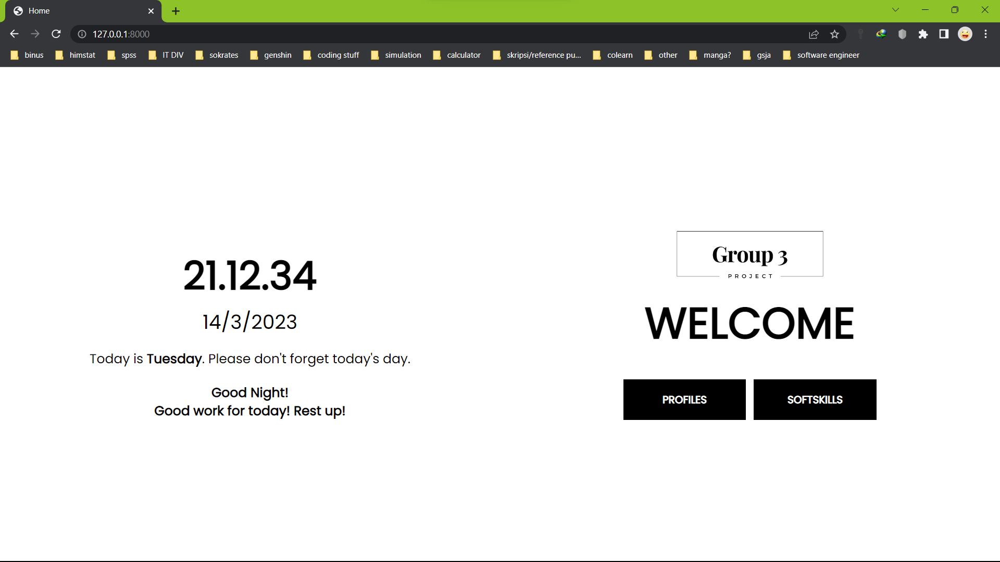
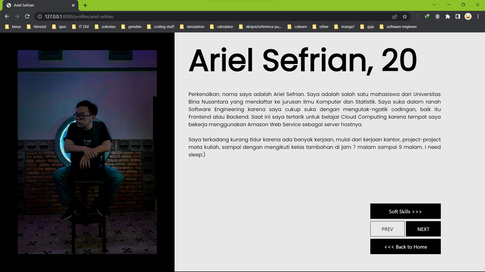
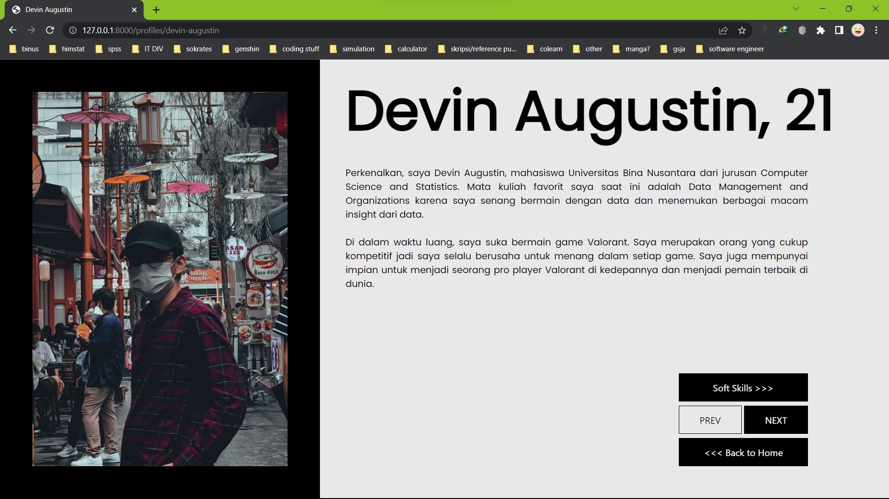
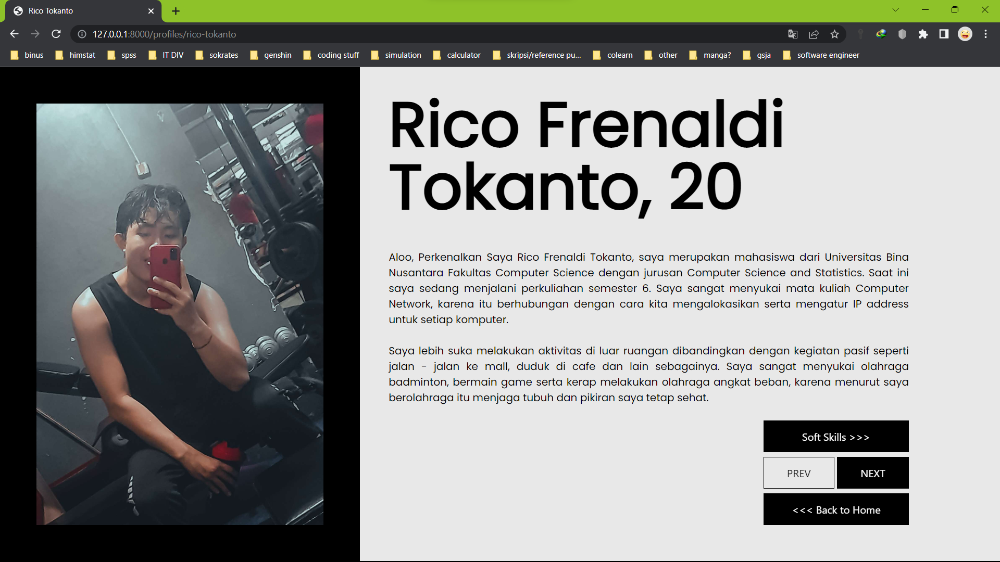
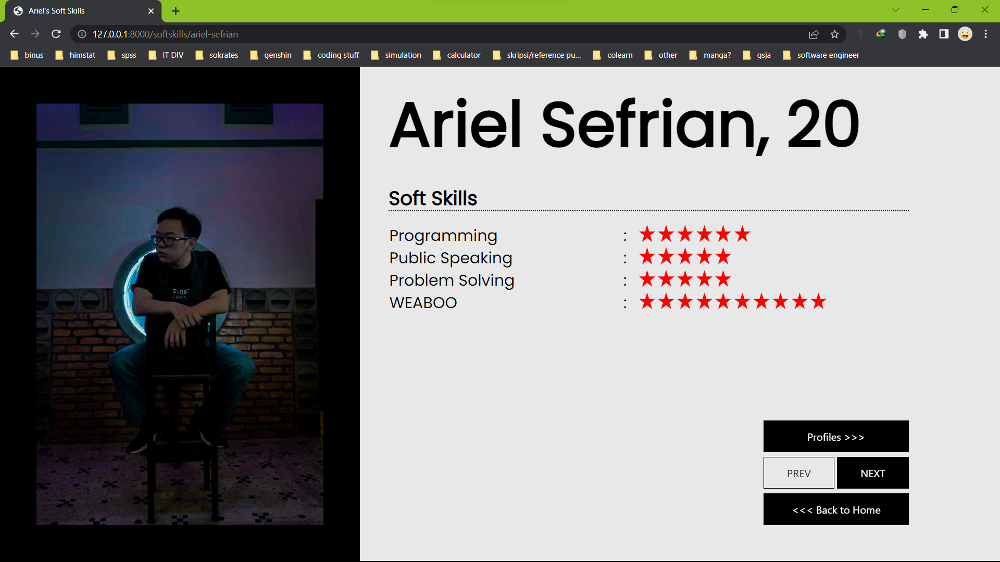
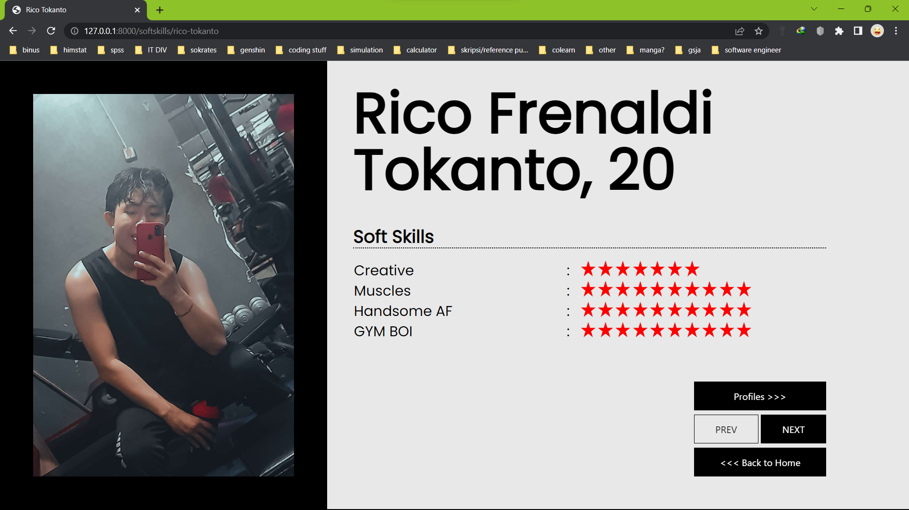

# Profile Kelompok 3

### Anggota:
- 2440067175 - Ariel Sefrian
- 2440094352 - Devin Augustin
- 2440114373 - Rico Frenaldi Tokanto

Repository ini berisi tentang profile singkat anggota kelompok 3. Berikut adalah screenshotnya:

**Home Page**
   

**Profile Pages**
1. Profile Ariel Sefrian
   
   
2. Profile Devin Augustin
   

3. Profile Rico Frenaldi Tokanto
   

**Soft Skills Pages**
1. Soft Skills Ariel Sefrian
   

2. Soft Skills Devin Augustin
   

3. Soft Skills Rico Frenaldi Tokanto
   

Repository menggunakan **Tailwind CSS**

Cara untuk menjalankan repository:
1. Jalankan `composer install`
2. Copy file `.env.example`, kemudian paste di folder projectnya dan hapus `.example`, sehingga hanya tersisa `.env`
3. Apabila file `.env` sudah ada, jalankan `php artisan key:generate`
4. Setelah itu jalankan `php artisan cache:clear` dan `php artisan config:clear`
5. Jalankan `npm install`, tunggu sampai selesai install
6. Jalankan `npm run watch-poll`
7. Buka terminal baru, jalankan `php artisan serve`, jadi ada 2 terminal yang menjalankan `npm run watch poll` dan `php artisan serve`
8. Navigasi ke localhost yang digenerate oleh `php artisan serve`

### Note:
Branch yang bisa dipakai (default) adalah branch **production**, jadi kalau mau download silahkan ke branch production kemudian download zip.

## Copyright
#### @Kelompok 3 - Owner: Ariel Sefrian - All Rights Reserved
